# Create &amp; Maintain Web Content

Matthew Reidsma

-----

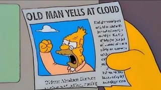

-----

<h1>Library Website</h1>

-----

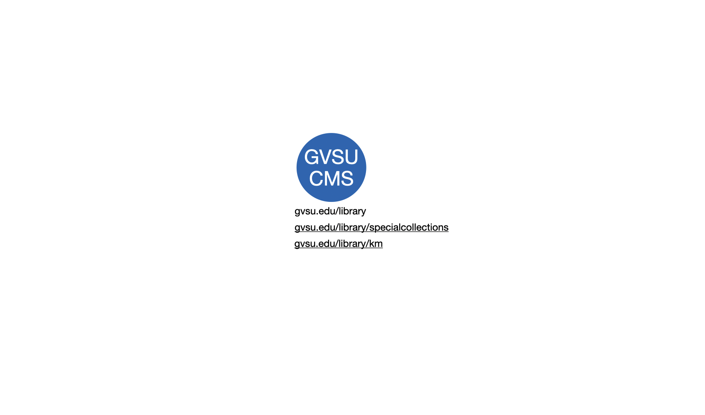

-----

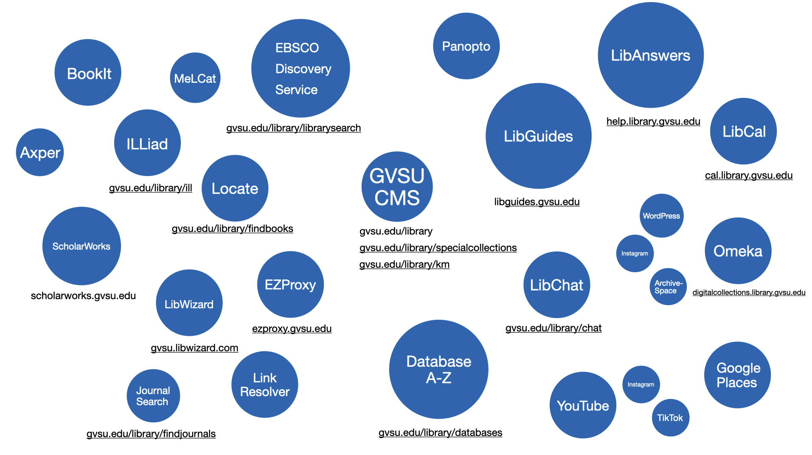

-----

### The library website is an integrated representation of the library, providing continuously updated content and tools to engage with the academic mission of the university.

#### Courtney McDonald and Heidi Burkhardt 

"Library-Authored Web Content and the Need for Content Strategy", <em>Information Technology and Libraries</em>, September 2019; p.15

-----

### [The library website] is constructed and maintained for the benefit of the user.

#### Courtney McDonald and Heidi Burkhardt 

"Library-Authored Web Content and the Need for Content Strategy", <em>Information Technology and Libraries</em>, September 2019; p.15

-----

<h1>Librarian-authored Content</h1>

-----

<h1><em>Library</em>-authored Content</h1>

-----

### Libraries lack an editorial culture where content production and management is viewed as a collective rather than a personal effort.

#### Suzanne Chapman and Ian Demsky

"Taming the Kudzu: An Academic Library's Experience with Web Content Strategy", <em>Cutting-Edge Research in Developing the Library of the Future</em>, ed. Bradford Lee Eden (Lanham, MD: Rowman & Littlefield, 2015). p.35.

-----

<h1>What is Content Strategy?</h1>

-----

<!-- .slide: data-background-image="img/kissane.jpg" -->

### Good Content is <em>Appropriate</em>

#### Erin Kissane

Kissane, E. (2011). *The Elements of Content Strategy*. New York: A Book Apart. p. 4.

-----

-----

<!-- .slide: data-background-image="img/kissane.jpg" -->

### Good Content is <em>Useful</em>

#### Erin Kissane

Kissane, E. (2011). *The Elements of Content Strategy*. New York: A Book Apart. p. 7.

-----

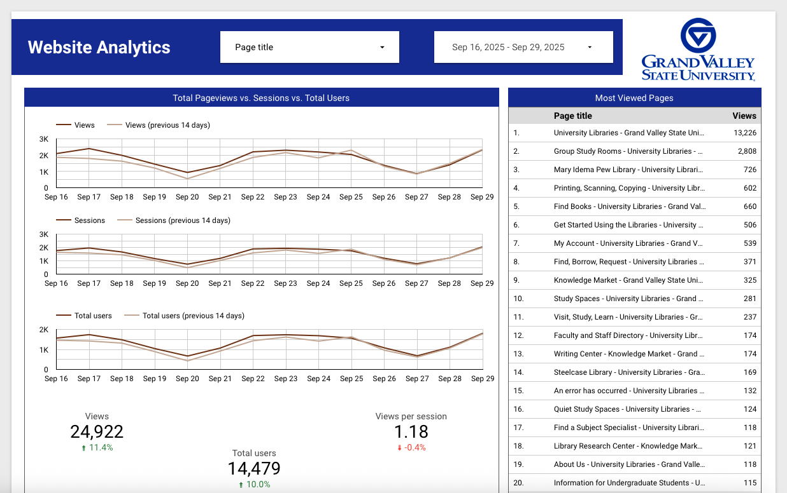

-----

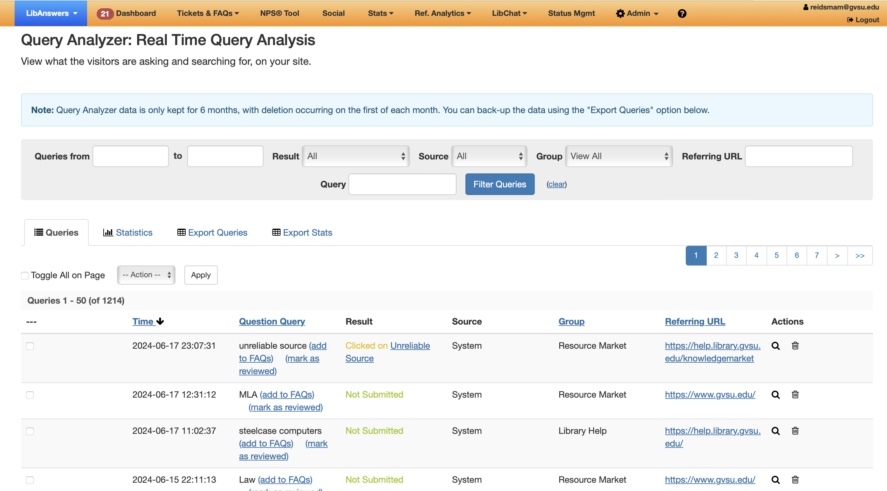

-----

<!-- .slide: data-background-image="img/kissane.jpg" -->

### Good Content is <em>User-Centered</em>

#### Erin Kissane

Kissane, E. (2011). *The Elements of Content Strategy*. New York: A Book Apart. p. 8.

-----
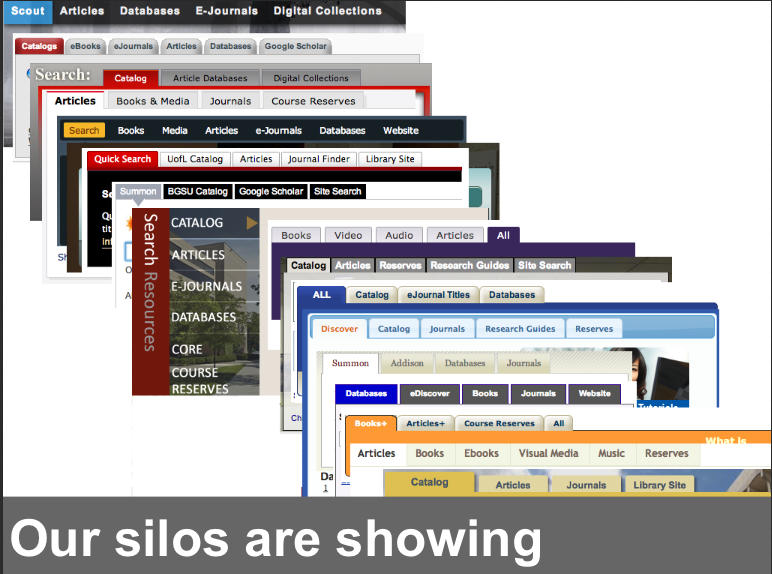

Erin White, VCU Libraries.

-----

<!-- .slide: data-background-image="img/kissane.jpg" -->

### Good Content is <em>Clear</em>

#### Erin Kissane

Kissane, E. (2011). *The Elements of Content Strategy*. New York: A Book Apart. p. 9.

-----

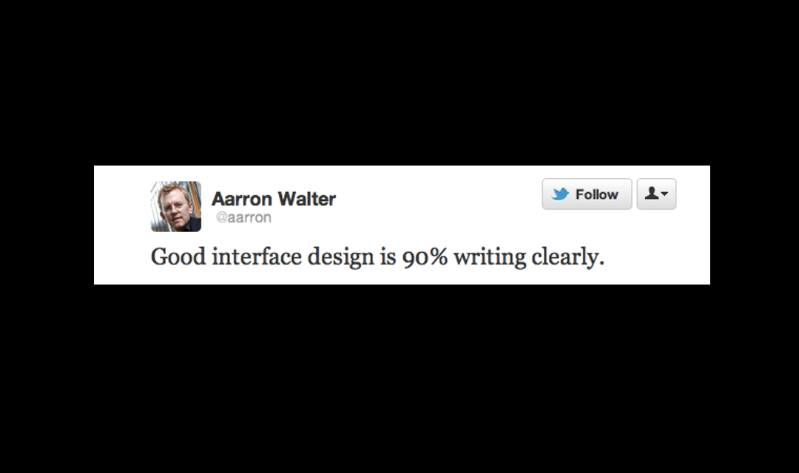

-----

<!-- .slide: data-background-image="img/kissane.jpg" -->

### Good Content is <em>Consistent</em>

#### Erin Kissane

Kissane, E. (2011). *The Elements of Content Strategy*. New York: A Book Apart. p. 10.

-----

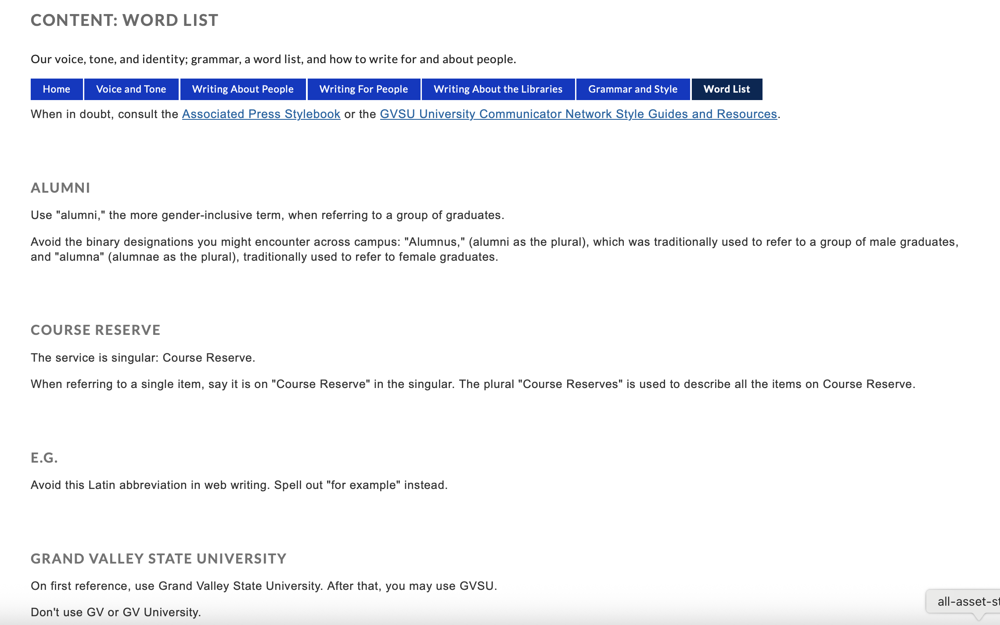

[Univeristy Libraries Design System](https://libguides.gvsu.edu/content/wordlist)

-----

<!-- .slide: data-background-image="img/kissane.jpg" -->

### Good Content is <em>Concise</em>

#### Erin Kissane

Kissane, E. (2011). *The Elements of Content Strategy*. New York: A Book Apart. p. 11.

-----

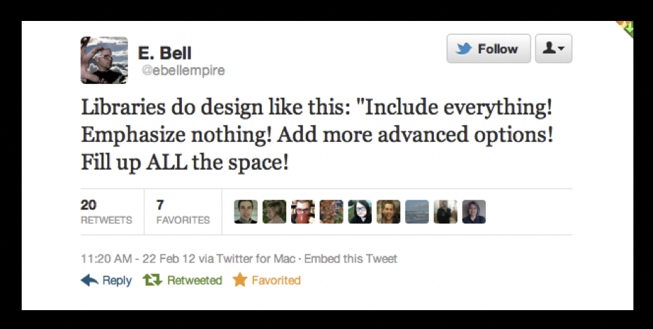

[E. Bell](https://twitter.com/#!/ebellempire/status/172355190232592384)

-----

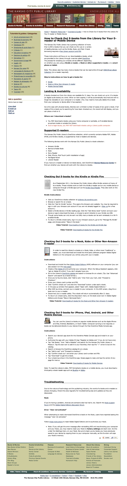

-----

<!-- .slide: data-background-image="img/kissane.jpg" -->

### Good Content is <em>Supported</em>

#### Erin Kissane

Kissane, E. (2011). *The Elements of Content Strategy*. New York: A Book Apart. p. 12.

-----

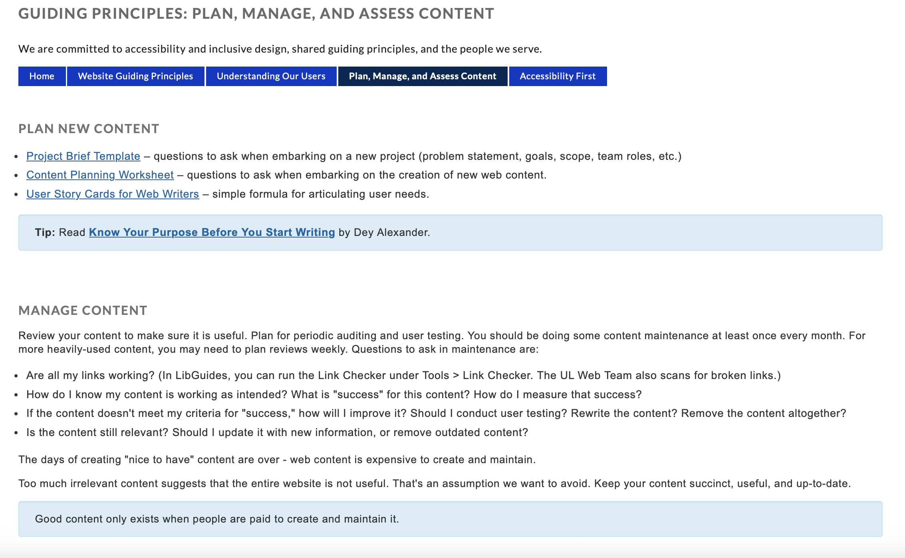

[Univeristy Libraries Style Guide](https://libguides.gvsu.edu/guidingprinciples/planmanageassess)

-----

## Managing Content

1. Is it still relevant?

-----

## Managing Content

1. Is it still relevant?
2. Is it still accurate?

-----

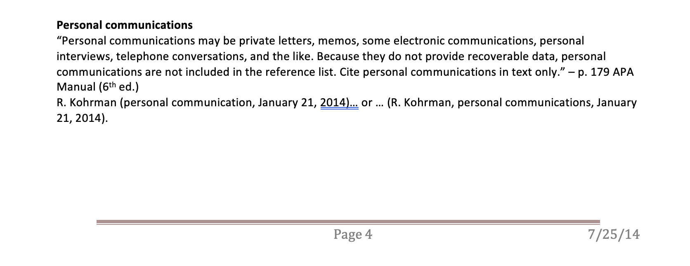

-----

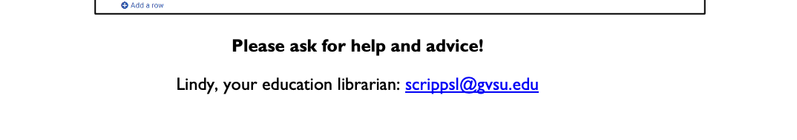

-----

## Managing Content

1. Is it still relevant?
2. Is it still accurate?
3. Do the links work?

-----

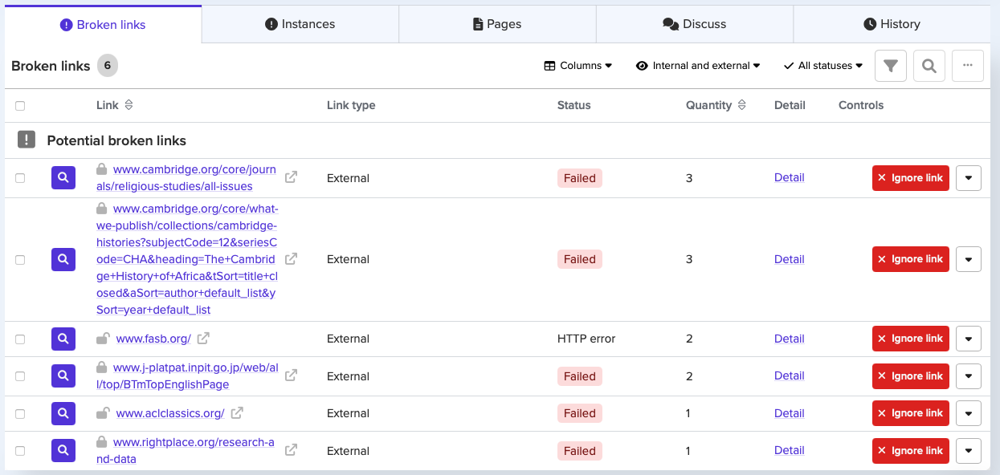

[Silktide](https://silktide.com)

-----

## Managing Content

1. Is it still relevant?
2. Is it still accurate?
3. Do the links work?
4. What is the goal? What does "success" look like?

-----

## Managing Content

1. Is it still relevant?
2. Is it still accurate?
3. Do the links work?
4. What is the goal? What does "success" look like?
5. If not meeting goals, how to improve?

-----

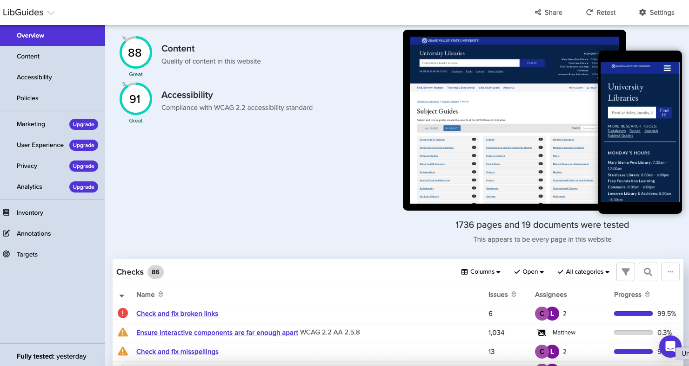

[Silktide](https://silktide.com)

-----

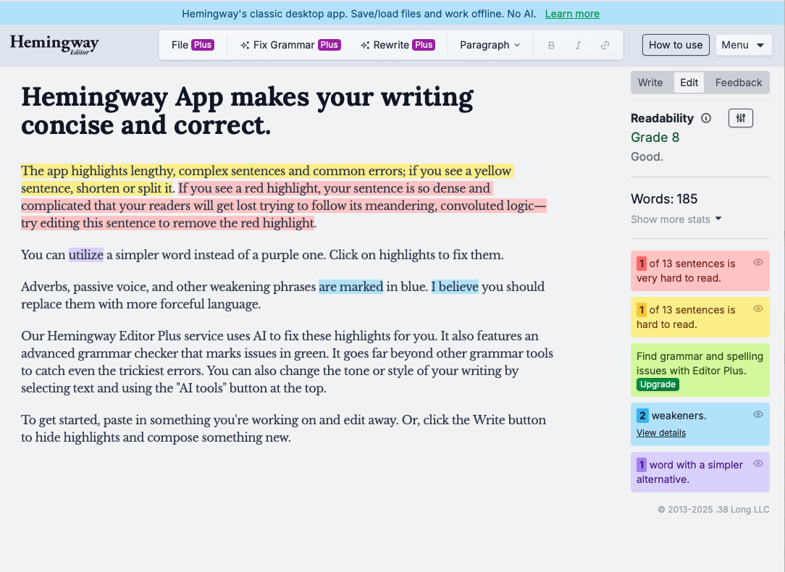

[Hemingway App](https://hemingwayapp.com)

-----

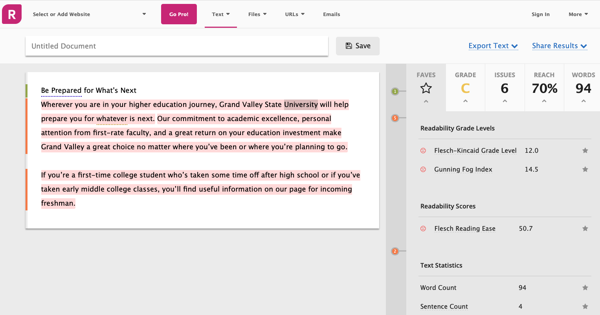

[Readability Score](https://readability-score.com)

-----

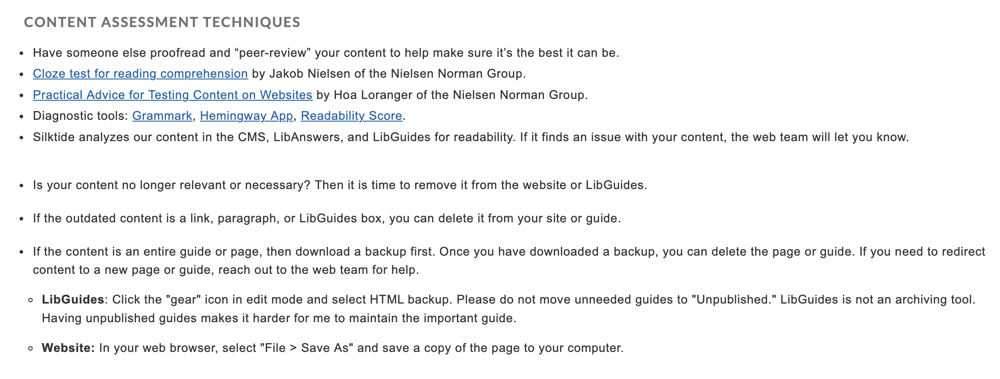

[Univeristy Libraries Style Guide](https://libguides.gvsu.edu/guidingprinciples/planmanageassess)

-----

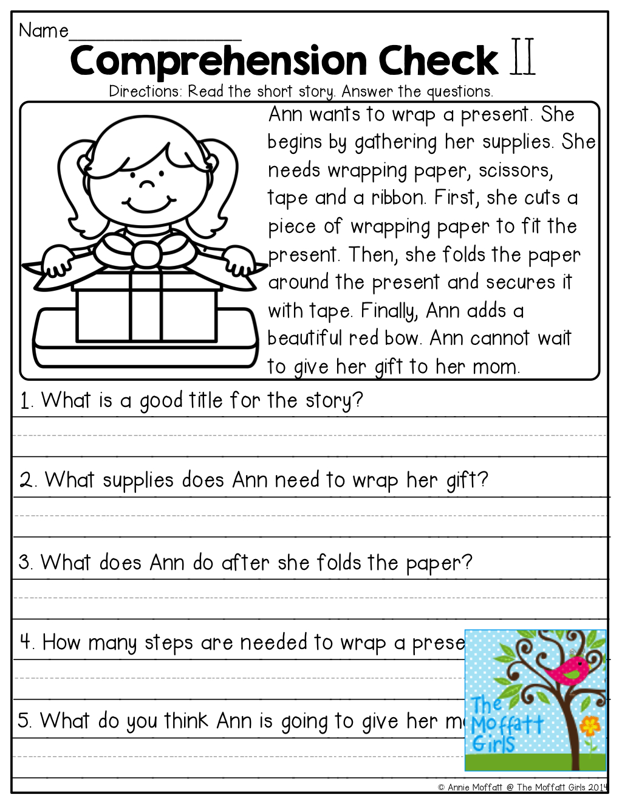

Comprehension Tests

-----

## Resources

* [UL Style Guide](https://gvsu.edu/library/styleguide)
* [Content Strategy Checklist](https://alistapart.com/article/a-checklist-for-content-work/)

-----

# ThankYou 

